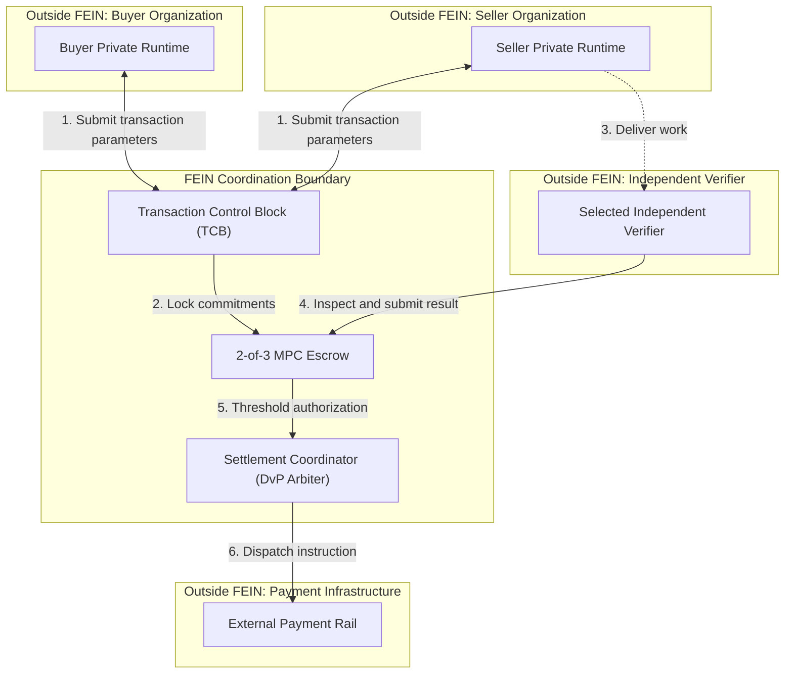

# ADR-0001: FEIN Architecture

- **Status:** Draft v.01
- **Owner:** Samruddhi Shekatkar
- **Date:** 2026-10-04

This ADR must be reviewed and agreed before it is marked Accepted. If the architecture decision changes later, create a new ADR and link it to this ADR. Do not silently rewrite the earlier decision.

## 1. Context

Different organizations own different software systems. Each organization uses its own data models and risk policies.

Organizations cannot fully trust other organizations to complete transactions correctly. Blind trust creates financial risk.

A centralized clearinghouse could coordinate these transactions. However, this would reduce the control that organizations have over their own data and infrastructure. This would compromise enterprise sovereignty.

FEIN therefore needs a clear architecture boundary. The boundary must coordinate transactions without taking control of the internal computing environments of the participating organizations.

The main architectural goals are:
- Bind buyer and seller commitments safely.
- Coordinate independent delivery verification.
- Coordinate conditional settlement.
- Keep each organization's private computing environment under that organization's control.

FEIN is an external coordination boundary. It does not replace the private systems of the participating organizations.

## 2. Decision

The proposed FEIN architecture uses an external coordination mechanism.

FEIN operates outside the internal boundaries of the participating organizations. It focuses on three responsibilities:
- Transaction binding.
- Delivery verification coordination.
- Conditional settlement coordination.

Other functions remain outside the FEIN boundary.

### 2.1 Sovereign Runtimes

Each organization keeps control of its own private runtime.

This includes:
- Data
- Logic
- Keys
- Compute resources
- Risk policies

FEIN does not control or host the internal execution systems of the participating organizations.

### 2.2 Transaction Control Block

The Transaction Control Block (TCB) stores the main information about a transaction.

The TCB contains:
- Transaction ID (TID)
- Contract hash
- Verifier identity
- Time-to-live (TTL)
- Risk ceiling
- Buyer capital commitment
- Seller deliverable hash

The TCB must bind the transaction parameters cryptographically.
The final TCB serialization and wire format are not yet decided.

### 2.3 Escrow

The proposed architecture uses a stateless 2-of-3 Multi-Party Computation (MPC) system for escrow.

The three parties are:
- Buyer
- Seller
- Selected independent verifier

No single party should be able to release the funds alone.
The exact mapping of threshold results to success, abort, refund, and cooperative resolution is not yet decided.

### 2.4 Delivery Verification

An independent verifier checks the delivered work against the agreed criteria.
The verifier also participates in escrow authorization.
The rules for verifier selection, governance, failure handling, and dispute handling are not yet defined.

### 2.5 Settlement Coordination

The Settlement Coordinator acts as the arbiter for Delivery versus Payment (DvP).

After successful verification, the coordinator produces:
- A delivery receipt.
- An accounting-log entry.
- A payment instruction.

The current architecture does not demonstrate operational atomicity between these FEIN outputs and the external payment system.

### 2.6 Discovery and Negotiation

FEIN does not provide participant discovery or negotiation.
These activities happen before the FEIN transaction through external mechanisms.
Technologies such as the NANDA Index and A2A are mentioned as examples. They are not approved FEIN technology choices.

### 2.7 External Payment

FEIN does not move money directly.
Actual money movement is performed by an external payment system.
AP2 is mentioned as an example of an external payment technology. It is not an approved FEIN technology choice.

### 2.8 High-Level Architecture Flow

The following diagram shows the proposed FEIN architecture boundary and its main components.

This diagram shows the proposed architectural boundary. FEIN does not move actual money. FEIN sends an instruction to an external payment system.

## 3. Options Considered

| Option | Verdict | Rationale |
|---|---|---|
| External Coordination | Proposed | Preserves enterprise control and keeps the FEIN boundary limited to coordination functions. Organizations retain control over their own private runtimes. |
| Centralized Clearinghouse | Rejected | Compromises enterprise sovereignty by reducing organizational control over internal systems and infrastructure. |
| Integrated Discovery and Payment | Rejected | Expands the FEIN boundary beyond its core responsibilities. Discovery, negotiation, and actual money movement are outside the current FEIN scope. |

## 4. Consequences

### 4.1 Trade-offs

- Participating organizations must build integration layers to connect their private runtimes to FEIN.
- The TCB must accept transaction information from upstream discovery and negotiation.
- The 2-of-3 MPC escrow requires complex cryptographic coordination.

### 4.2 Risks

- FEIN depends on the availability and correct operation of the selected independent verifier.
- FEIN depends on an external payment system for actual money movement.
- A network or external payment failure could cause a mismatch between FEIN settlement records and the external payment state.
- The current architecture does not demonstrate operational atomicity between FEIN outputs and the external payment system.

### 4.3 Follow-up Work

The following items remain open architecture decisions:
- **TCB serialization and wire format:** The final schema, field encoding, and parsing rules are not yet defined.
- **Commitment and hash rules:** The exact hashing and verification rules are not yet defined.
- **Deliverable-manifest rules:** The structure and digest rules for deliverables are not yet defined.
- **Verifier selection and governance:** The rules for selecting and governing the verifier are not yet defined.
- **Verifier failure handling:** The rules for verifier timeout and replacement are not yet defined.
- **Dispute handling:** The process for disputes between the parties and the verifier is not yet defined.
- **MPC threshold outcome mapping:** The exact mapping of 2-of-3 results to success, abort, refund, and cooperative resolution is not yet defined.
- **Receipt and accounting-log atomicity:** The method for keeping FEIN records consistent with payment dispatch is not yet defined.
- **External payment coordination:** The interface between FEIN settlement instructions and external payment systems is not yet defined.
- **Retry and partial-failure behavior:** The rules for retry, recovery, and reconciliation after external payment failures are not yet defined.

## 5. Related Requirements / ADRs

- [FEIN Vision](../00-vision.md)
- [FEIN Problem Statement](../01-problem.md)
- [FEIN Architecture](../02-architecture.md)
- [FEIN Non-Goals](../03-non-goals.md)
- [FEIN Threat Model](../threatmodel.md)

No other ADRs exist yet. Future ADRs for TCB formatting, verifier governance, escrow behavior, or payment coordination should link back to this ADR when they change or refine this architectural decision.
