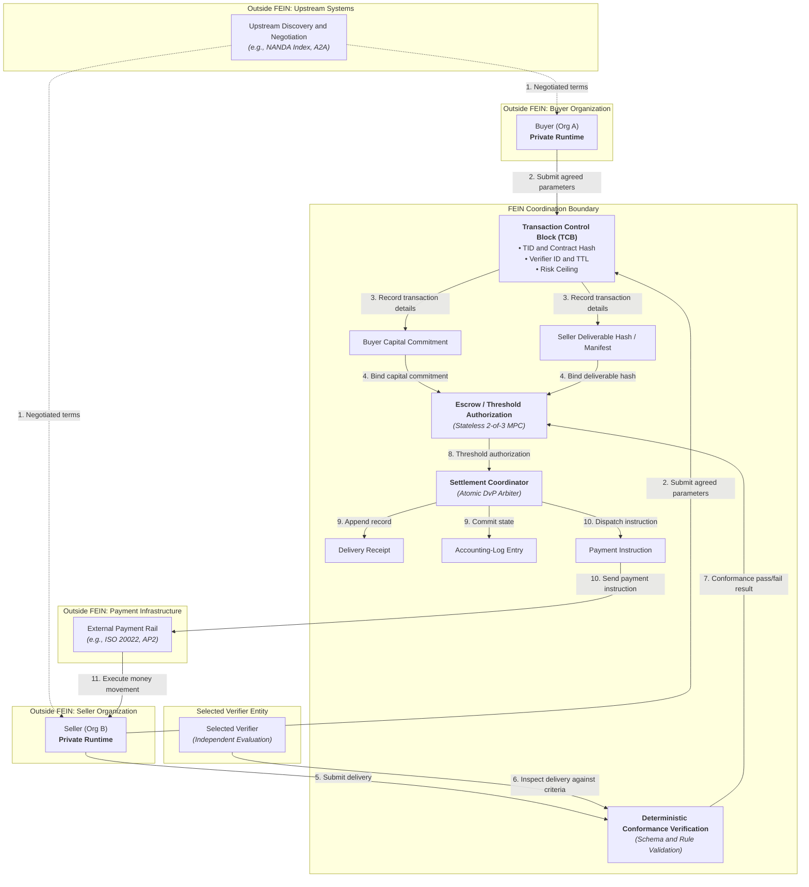

# FEIN Threat Model

## 1. Purpose

This document identifies plausible security threats for the Financial Enterprise Intelligence Network (FEIN).

FEIN coordinates economic transactions between autonomous agents belonging to independent organizations. Participating organizations operate in separate security domains and do not share mutual trust.

The main security goals of FEIN are:
- Bind buyer and seller commitments before work starts.
- Verify delivered work against agreed criteria.
- Authorize settlement or abort/refund based on the defined verification outcome.
- Keep each organization's private runtime under that organization's control.

> FEIN is a coordination boundary. It is not the private runtime of the buyer or seller.

> This document describes plausible threats. A threat listed here is not a confirmed vulnerability.

---

## 2. System Scope

FEIN covers:
- Commitment binding between counterparties.
- Independent delivery verification against contractual criteria.
- Custody authorization through threshold consensus.
- Conditional delivery-versus-payment (DvP) settlement coordination.

FEIN does not provide:
- Agent discovery.
- Agent messaging or negotiation.
- Agent execution or task orchestration.
- A banking or payment rail.
- A monolithic centralized clearinghouse.

Discovery and negotiation happen upstream through external mechanisms before FEIN initializes a transaction. Actual money movement is performed by an existing external payment rail after FEIN authorizes settlement.

---

## 3. Security Objectives

1. **Commitment integrity**: FEIN should protect the buyer capital commitment and seller deliverable commitment recorded in the Transaction Control Block (TCB) against unauthorized changes.
2. **Transaction identity**: The design should assign a globally unique identifier (TID) to every transaction session to prevent transaction mix-ups and collision.
3. **Verification integrity**: FEIN should ensure that an independent verifier checks delivered work against the agreed contract criteria using deterministic evaluation without tampering.
4. **Escrow authorization**: The design should ensure that releasing funds or executing refunds requires valid multi-party threshold approval and cannot occur unilaterally.
5. **Settlement authorization**: FEIN should trigger settlement instructions if and only if the verification conditions meet the agreed threshold criteria.
6. **Receipt integrity**: The design should generate delivery receipts and accounting-log records that accurately reflect the final transaction state and resist unauthorized modification.
7. **Private data protection**: FEIN should ensure that proprietary models, private keys, customer records, and internal compute remain protected within each organization's domestic runtime.
8. **Replay protection**: The design should prevent reuse of old transactions, expired authorizations, or past verification results.
9. **Expiry enforcement**: FEIN should enforce a transaction Time-to-Live (TTL) so that unfulfilled or stalled transactions abort and refund correctly.

---

## 4. Actors

| Actor | Role | Trust assumption |
|---|---|---|
| **Buyer (Org A)** | Requests work, commits capital, and receives deliverable | Untrusted by Seller and Verifier; assumed to act in its own commercial interest |
| **Seller (Org B)** | Executes task in private runtime, commits deliverable hash, and delivers work | Untrusted by Buyer and Verifier; assumed to act in its own commercial interest |
| **Selected Verifier** | Inspects delivered work against contractual criteria and participates in threshold authorization | Intended to be an independent third party; not assumed to be unconditionally trustworthy or immune to failure |
| **Settlement Coordinator** | Coordinates DvP outcome, appends receipts, commits logs, and emits payment instructions | Assumed to follow protocol logic; relies on external payment rails for actual fund movement |
| **External Payment Rail** | Executes actual monetary transfer between institutions upon receipt of payment instruction | External infrastructure; outside FEIN operational boundary and trust model |
| **Buyer/Seller Private Runtime** | Hosts enterprise models, proprietary datasets, private keys, and task execution | Private to each organization; outside FEIN coordination boundary |

---

## 5. High-Level Data Flow

The following diagram illustrates the intended transaction flow and major external dependencies.

> This diagram shows the intended conceptual flow. It does not claim that delivery receipt, accounting-log entry, and external payment are operationally atomic in the current implementation.

---

## 6. Trust Boundaries

FEIN operates across four primary trust boundaries.

- **TB-1: Buyer/Seller private runtime ↔ FEIN**: Each enterprise controls its own models, data, keys, compute, policies, and private runtime. FEIN is an external coordination boundary and must not assume control of internal enterprise resources.
- **TB-2: Buyer/Seller ↔ Shared transaction state**: The TCB contains transaction information shared between counterparties. The TCB is intended to be immutable after commitment. The current specification does not state that immutability is already technically guaranteed.
- **TB-3: FEIN ↔ Selected verifier**: The selected verifier is intended to be an independent entity agreed upon by buyer and seller. The current specification does not define complete verifier governance or dispute handling.
- **TB-4: FEIN ↔ External payment rail**: FEIN dispatches payment instructions to an external payment system. The external rail performs the actual money transfer. The payment rail is outside the FEIN boundary.

```mermaid
flowchart LR
    subgraph BUYER_ZONE["Trust Zone 1: Buyer Organization"]
        subgraph BUYER_RUNTIME["Buyer Private Runtime"]
            B_Data["Buyer Data"]
            B_Models["Buyer Models"]
            B_Keys["Buyer Keys"]
            B_Compute["Buyer Compute"]
            B_Policies["Buyer Policies"]
        end
    end

    subgraph SELLER_ZONE["Trust Zone 2: Seller Organization"]
        subgraph SELLER_RUNTIME["Seller Private Runtime"]
            S_Data["Seller Data"]
            S_Models["Seller Models"]
            S_Keys["Seller Keys"]
            S_Compute["Seller Compute"]
            S_Policies["Seller Policies"]
        end
    end

    subgraph FEIN_ZONE["Trust Zone 3: FEIN Coordination Boundary"]
        TCB_B["Transaction Control Block (TCB)"]
        ESC_B["Escrow / Threshold Authorization"]
        CONF_B["Deterministic Conformance Result"]
        COORD_B["Settlement Coordinator"]
        REC_B["Receipt / Accounting-Log State"]
    end

    subgraph VERIFIER_ZONE["Trust Zone 4: Selected Verifier"]
        V_Activity["Verification Activity"]
        V_Result["Verification Result"]
    end

    subgraph PAYMENT_ZONE["Trust Zone 5: External Payment Rail"]
        P_Instr["Payment Instruction Received"]
        P_Move["Actual Money Movement"]
    end

    BUYER_RUNTIME <-->|"TB-1: Capital lock, terms, status"| FEIN_ZONE
    SELLER_RUNTIME <-->|"TB-1: Deliverable hash, delivery data, status"| FEIN_ZONE
    FEIN_ZONE <-->|"TB-3: Verification task and result"| VERIFIER_ZONE
    FEIN_ZONE -->|"TB-4: Payment instruction"| PAYMENT_ZONE
    PAYMENT_ZONE -.->|"Actual transfer"| SELLER_ZONE
```

- Each organization retains control of its private runtime.
- FEIN is an external coordination boundary.
- The selected verifier is intended to be independent.
- The payment rail is an external dependency.
- The current specification does not define complete verifier governance or dispute handling.
- The current specification does not demonstrate operational atomicity between FEIN records and the external payment rail.

---

## 7. Important Assets

| Asset | Description | Security property |
|---|---|---|
| **Transaction Control Block (TCB)** | Shared descriptor binding the transaction context and parameters | Integrity, Authenticity |
| **Transaction ID (TID)** | Unique session identifier for tracking across logs and systems | Uniqueness, Integrity |
| **Contract Hash** | Cryptographic digest of the negotiated scope, price, and terms | Integrity, Non-repudiation |
| **Verifier Identity** | Cryptographic identity or public address of the chosen verifier | Authenticity, Integrity |
| **Time-to-Live (TTL)** | Expiration timestamp bounding the transaction validity period | Integrity, Temporal correctness |
| **Risk Ceiling / Tolerance** | Financial and operational exposure limits agreed for the session | Integrity |
| **Buyer Capital Commitment** | Cryptographic or operational reservation of funds by Org A | Integrity, Non-repudiation |
| **Seller Deliverable Hash / Manifest** | Pre-committed digest or manifest of the target work product | Integrity, Non-repudiation |
| **Delivery Evidence** | The digital deliverable and supporting verification artifacts | Integrity, Authenticity |
| **Conformance Result** | Deterministic pass/fail verdict issued by verification logic | Integrity, Non-repudiation |
| **Escrow State** | Multi-party custody status tracking fund reservations | Integrity, State consistency |
| **Settlement Authorization** | Threshold authorization payload approving fund movement | Authenticity, Integrity |
| **Delivery Receipt** | Immutable record confirming completed deliverable verification | Integrity, Non-repudiation |
| **Accounting-Log Entry** | Committed ledger record documenting the state transition | Integrity, Append-only consistency |
| **Private Organizational Data** | Internal data, models, prompts, compute state, and private keys | Confidentiality, Sovereignty |

---

## 8. Risk Rating Method

The current FEIN specification does not define a formal risk-rating method. For this threat model, the following working proposal is used:

### Likelihood
- **Low**: Requires unusual conditions, high attacker complexity, or multiple coordinated failures.
- **Medium**: Realistic under some operating conditions.
- **High**: Realistic and directly reachable under ordinary operating conditions.

### Severity
- **Low**: Limited operational effect on a single transaction; easily corrected.
- **Medium**: Meaningful transaction delay, operational failure, or localized information exposure.
- **High**: Possible unauthorized value release, permanent capital loss, incorrect settlement, or major integrity impact.

### Risk Matrix

| Likelihood | Severity | Risk Level |
|---|---|---|
| Low | Low | Low |
| Low | Medium | Low |
| Low | High | Medium |
| Medium | Low | Low |
| Medium | Medium | Medium |
| Medium | High | High |
| High | Low | Medium |
| High | Medium | High |
| High | High | High |

> This rating is a working proposal and should be reviewed by the project team.

---

## 9. Threats

### TM-01 — Spoofed Buyer or Seller
- **Affected component:** Transaction Control Block (TCB), Boundary Interface (TB-1).
- **Attacker or scenario:** An unauthorized external agent impersonates Org A or Org B to bind false commitments, intercept deliverables, or claim unauthorized refunds.
- **Preconditions:** Upstream discovery or authentication fails to cryptographically bind agent identity to the counterparty enterprise.
- **Possible impact:** Unauthorized transaction creation, diversion of settlement funds, or fraudulent commitments.
- **Likelihood:** Medium
- **Severity:** High
- **Reason:** Upstream agent identification occurs outside FEIN; without strict mutual cryptographic authentication at the boundary, impersonation is a plausible threat.
- **Mitigation / follow-up:** The design should enforce cryptographic signature validation on all boundary messages and bind institutional identity keys to the TCB.
- **Owner:** Security Architecture Team
- **Status:** Open
- **Residual risk / test:** Test identity verification with invalid and spoofed enterprise credentials to confirm rejection.

---

### TM-02 — Spoofed Verifier
- **Affected component:** Conformance Interface, Selected Verifier Boundary (TB-3).
- **Attacker or scenario:** A malicious entity impersonates the agreed verifier and submits an unauthorized conformance result.
- **Preconditions:** Verifier public key is unverified, missing from the TCB, or verification messages lack authentic digital signatures.
- **Possible impact:** Unearned release of funds to a defaulting seller or fraudulent cancellation of valid work.
- **Likelihood:** Medium
- **Severity:** High
- **Reason:** The verifier is an external entity; if verifier identity binding is weak, rogue attestations can subvert settlement.
- **Mitigation / follow-up:** Bind the verifier's public key explicitly in the TCB and verify digital signatures on all incoming conformance verdicts.
- **Owner:** Protocol Engineering Team
- **Status:** Open
- **Residual risk / test:** Test injection of verification results signed by an unauthorized key.

---

### TM-03 — TCB Modification
- **Affected component:** Transaction Control Block (TCB).
- **Attacker or scenario:** An attacker alters active TCB fields (such as contract hash, TTL, verifier ID, or capital amounts) after commitment.
- **Preconditions:** TCB storage or message exchange lacks tamper-evident controls or immutable state enforcement.
- **Possible impact:** Changed contract scope, substituted verifier, extended expiration, or altered financial amounts.
- **Likelihood:** Medium
- **Severity:** High
- **Reason:** The TCB is intended to be immutable after commitment; if mutation is possible in the data store or transit, transaction integrity is broken.
- **Mitigation / follow-up:** The design should compute a canonical hash of the TCB upon commitment and verify the hash prior to every state transition.
- **Owner:** Core Engineering Team
- **Status:** Open
- **Residual risk / test:** Attempt post-commitment field mutation in storage and verify that the system rejects the transaction.

---

### TM-04 — Replay of an Old Transaction or Authorization
- **Affected component:** Settlement Coordinator, Escrow Authorization.
- **Attacker or scenario:** An attacker captures a valid signed authorization, TCB payload, or conformance attestation from a past transaction and resubmits it.
- **Preconditions:** Authorization payloads lack unique transaction session binding, timestamps, or nonce verification.
- **Possible impact:** Duplicate payment dispatch, unearned fund release, or repeated capital locking.
- **Likelihood:** Medium
- **Severity:** High
- **Reason:** Without strict replay prevention, cryptographically valid signatures from completed sessions could be replayed.
- **Mitigation / follow-up:** Require unique TID, monotonic counters, and strict TTL checks on all authorization and settlement messages.
- **Owner:** Security Architecture Team
- **Status:** Open
- **Residual risk / test:** Resubmit identical authorization payloads across different session attempts.

---

### TM-05 — Altered Delivery Evidence
- **Affected component:** Deterministic Conformance Verification.
- **Attacker or scenario:** A seller delivers a work product that differs from the pre-committed deliverable hash or tampers with inspection evidence in transit.
- **Preconditions:** Verification engine accepts deliverable payloads without validating against the pre-committed hash in the TCB.
- **Possible impact:** Substandard or non-compliant digital work accepted for settlement.
- **Likelihood:** Medium
- **Severity:** Medium
- **Reason:** If the deliverable hash check is decoupled from the conformance check, substitution attacks become plausible.
- **Mitigation / follow-up:** The conformance engine must compute the cryptographic hash of the received deliverable and match it against the locked TCB deliverable hash before evaluating rules.
- **Owner:** Conformance Engine Team
- **Status:** Open
- **Residual risk / test:** Submit a valid-schema payload with a non-matching hash and verify failure.

---

### TM-06 — False or Bypassed Conformance Result
- **Affected component:** Deterministic Conformance Verification, Settlement Coordinator.
- **Attacker or scenario:** An attacker bypasses schema validation rules, forces a false pass verdict, or exploits non-deterministic rule evaluation.
- **Preconditions:** Conformance logic relies on subjective heuristics or unpinned validation schemas.
- **Possible impact:** Payment released for defective or invalid work products.
- **Likelihood:** Medium
- **Severity:** High
- **Reason:** Conformance is the sole gate for conditional settlement; any nondeterminism or bypass breaks the DvP guarantee.
- **Mitigation / follow-up:** Implement strict, deterministic schema checks and immutable Python rule sets. Do not introduce LLM-as-judge logic for settlement gating.
- **Owner:** Conformance Engine Team
- **Status:** Open
- **Residual risk / test:** Execute boundary-value test suites and invalid payloads against the rule engine.

---

### TM-07 — Unauthorized Escrow Release
- **Affected component:** Escrow / Threshold Authorization.
- **Attacker or scenario:** A single party (Buyer, Seller, or Verifier) attempts to unilaterally trigger fund release or confiscation without meeting threshold requirements.
- **Preconditions:** Escrow logic allows 1-of-n execution or contains flaws in threshold state evaluation.
- **Possible impact:** Theft of escrowed capital or premature fund transfer before delivery verification.
- **Likelihood:** Low
- **Severity:** High
- **Reason:** The design specifies a stateless 2-of-3 MPC model; a single compromised participant should not possess sufficient signing authority.
- **Mitigation / follow-up:** Enforce cryptographic 2-of-3 multi-signature verification prior to releasing settlement instructions.
- **Owner:** Core Engineering Team
- **Status:** Open
- **Residual risk / test:** Attempt settlement triggers with only 1 signature and verify rejection.

---

### TM-08 — Settlement Authorization Used After Expiry
- **Affected component:** Settlement Coordinator, TCB Expiry Handler.
- **Attacker or scenario:** A delayed delivery or stale authorization is processed after the transaction TTL has expired.
- **Preconditions:** Settlement Coordinator fails to validate current clock time against the TCB TTL timestamp before executing settlement.
- **Possible impact:** Buyer's capital is paid out after the buyer already considered the agreement lapsed or cancelled.
- **Likelihood:** Medium
- **Severity:** Medium
- **Reason:** Network lag, clock drift, or slow verifier response can cause execution attempts across the TTL boundary.
- **Mitigation / follow-up:** Ensure the Settlement Coordinator performs an atomic check of current UTC time against TCB TTL before producing payment instructions.
- **Owner:** Protocol Engineering Team
- **Status:** Open
- **Residual risk / test:** Submit valid verification results 1 millisecond past TTL and confirm transaction aborts.

---

### TM-09 — Duplicate Settlement
- **Affected component:** Settlement Coordinator, External Payment Boundary (TB-4).
- **Attacker or scenario:** Network timeout occurs between FEIN and the payment rail; a retry triggers a second monetary transfer for the same transaction.
- **Preconditions:** Payment dispatch lacks idempotent transaction references or deduplication mechanisms.
- **Possible impact:** Multiple fund transfers executed for a single deliverable.
- **Likelihood:** Medium
- **Severity:** High
- **Reason:** External payment rails require explicit idempotency keys; retrying network calls without deduplication often causes duplicate charges.
- **Mitigation / follow-up:** Assign unique idempotency keys derived from TID and contract hash to every outbound payment instruction.
- **Owner:** Payment Integration Team
- **Status:** Open
- **Residual risk / test:** Simulate network drop on payment dispatch and execute automatic retries against mock rails.

---

### TM-10 — Receipt or Accounting-Log Manipulation
- **Affected component:** Settlement Coordinator, Receipt Store, Accounting Log.
- **Attacker or scenario:** An attacker alters or deletes stored delivery receipts or accounting log entries to conceal fraud or dispute settlement history.
- **Preconditions:** Log entries are stored in a mutable, unauthenticated database without cryptographic chaining.
- **Possible impact:** Inability to audit transactions, loss of evidence during commercial disputes.
- **Likelihood:** Low
- **Severity:** Medium
- **Reason:** Internal database modification is a plausible threat if administrative credentials or storage layers are compromised.
- **Mitigation / follow-up:** Use cryptographic hash chaining and digital signatures on all appended receipts and accounting-log records.
- **Owner:** Core Engineering Team
- **Status:** Open
- **Residual risk / test:** Attempt retroactive row modification in the log database and verify audit trail alerts.

---

### TM-11 — Missing Receipt
- **Affected component:** Settlement Coordinator, Evidence Framework.
- **Attacker or scenario:** A system crash occurs after payment dispatch but before the delivery receipt or token log entry is written, or vice versa.
- **Preconditions:** The Settlement Coordinator outputs are not coordinated in an atomic transaction.
- **Possible impact:** Funds are transferred, but no verifiable delivery receipt exists, leaving an inconsistent audit state.
- **Likelihood:** Medium
- **Severity:** Medium
- **Reason:** Operational atomicity between local logging and external payment dispatch is not demonstrated in the current specification.
- **Mitigation / follow-up:** Design a two-phase journaling mechanism with transactional recovery to reconcile logs and payment states upon restart.
- **Owner:** Architecture Team
- **Status:** Open
- **Residual risk / test:** Inject crash faults immediately prior to and after payment instruction dispatch.

---

### TM-12 — Cross-Organization Data Leakage
- **Affected component:** Boundary Interfaces (TB-1, TB-3).
- **Attacker or scenario:** Sensitive enterprise prompts, internal business rules, training data, or private customer records are exposed to the counterparty or verifier during delivery or conformance checks.
- **Preconditions:** Work product packaging inadvertently includes internal runtime context or unredacted raw datasets.
- **Possible impact:** Violation of data protection regulations, commercial espionage, loss of intellectual property.
- **Likelihood:** Medium
- **Severity:** High
- **Reason:** Enterprises exchange digital deliverables across organizational boundaries; without strict payload boundary filtering, private data can leak.
- **Mitigation / follow-up:** Keep runtime models and raw data strictly inside domestic boundaries. Standardize deliverable schemas to contain only required output fields.
- **Owner:** Security Architecture Team
- **Status:** Open
- **Residual risk / test:** Perform static inspection and schema validation on outbound delivery payloads.

---

### TM-13 — Verifier Failure or Unavailability
- **Affected component:** Selected Verifier Boundary (TB-3), Escrow State.
- **Attacker or scenario:** The selected verifier crashes, goes offline, or refuses to inspect the deliverable before the transaction TTL expires.
- **Preconditions:** Single designated verifier without operational failover, heartbeat monitoring, or dispute resolution.
- **Possible impact:** Valid deliverables cannot be certified; transaction times out and forces an abort/refund, causing loss of compute for the seller.
- **Likelihood:** High
- **Severity:** Medium
- **Reason:** The current specification relies on a designated verifier but does not specify verifier governance, fallback verifiers, or dispute escalation.
- **Mitigation / follow-up:** Define protocol rules for verifier heartbeat monitoring, agreed fallback selection, and cooperative resolution paths.
- **Owner:** Protocol Engineering Team
- **Status:** Open
- **Residual risk / test:** Simulate an unresponsive verifier during delivery submission to observe timeout handling.

---

### TM-14 — External Payment Rail Failure
- **Affected component:** External Payment Rail Boundary (TB-4).
- **Attacker or scenario:** The external payment rail rejects the instruction, experiences network partition, or delays execution indefinitely.
- **Preconditions:** External payment system outage or account-level liquidity failure outside FEIN control.
- **Possible impact:** Discrepancy between FEIN settlement authorization state and real-world banking ledger state.
- **Likelihood:** Medium
- **Severity:** High
- **Reason:** FEIN does not move funds directly; relying on external systems introduces split-state risk if external confirmation is lost.
- **Mitigation / follow-up:** Implement asynchronous payment callback acknowledgment, settlement status polling, and reconciliation queues.
- **Owner:** Payment Integration Team
- **Status:** Open
- **Residual risk / test:** Simulate payment gateway timeout and rejected transaction response codes.

---

## 10. Threat Summary

| ID | Threat | Likelihood | Severity | Status |
|---|---|---|---|---|
| **TM-01** | Spoofed Buyer or Seller | Medium | High | Open |
| **TM-02** | Spoofed Verifier | Medium | High | Open |
| **TM-03** | TCB Modification | Medium | High | Open |
| **TM-04** | Replay of an Old Transaction or Authorization | Medium | High | Open |
| **TM-05** | Altered Delivery Evidence | Medium | Medium | Open |
| **TM-06** | False or Bypassed Conformance Result | Medium | High | Open |
| **TM-07** | Unauthorized Escrow Release | Low | High | Open |
| **TM-08** | Settlement Authorization Used After Expiry | Medium | Medium | Open |
| **TM-09** | Duplicate Settlement | Medium | High | Open |
| **TM-10** | Receipt or Accounting-Log Manipulation | Low | Medium | Open |
| **TM-11** | Missing Receipt | Medium | Medium | Open |
| **TM-12** | Cross-Organization Data Leakage | Medium | High | Open |
| **TM-13** | Verifier Failure or Unavailability | High | Medium | Open |
| **TM-14** | External Payment Rail Failure | Medium | High | Open |

> These ratings are working values for review. They are not confirmed vulnerabilities.

---

## 11. Key Open Security Decisions

The following items are unresolved architectural decisions in the current specification:

1. **Exact TCB serialization and wire format**: Canonical schema, field encoding, and parsing standards are not yet finalized.
2. **Exact commitment and hash semantics**: Detailed hashing algorithms, canonicalization steps, and verification procedures are open.
3. **Exact deliverable-manifest semantics**: Structure of multi-part deliverables, file packaging, and digest representations are open.
4. **Verifier selection and authentication**: Governance framework for how counterparties discover, select, and establish trust in a verifier.
5. **Verifier failure handling**: Operational steps, timeouts, and replacement policies when a designated verifier is unresponsive.
6. **Dispute handling**: Recourse mechanisms when buyer or seller challenges a verifier's finding.
7. **Exact t-of-n escrow combinations**: Formal definition of threshold signatories, key management, and cryptographic primitives for MPC.
8. **Mapping of threshold outcomes**: Exact state transitions mapping 2-of-3 combinations to success, abort, and cooperative resolution.
9. **Receipt and accounting-log atomicity**: Guaranteeing consistent local persistence of delivery receipts and token log records.
10. **Coordination with external payment rails**: Protocol interface connecting settlement instructions to external rails (such as AP2 or ISO 20022).
11. **Retry and partial-failure behavior**: State reconciliation rules when payment rails fail, timeout, or experience partial processing.
12. **Evidence disclosure requirements**: Guidelines determining what portion of delivered work or logs must be disclosed to third-party auditors.

These items represent open architecture decisions and must not be presented as finished mechanisms.

---

## 12. Assumptions

- Buyer and seller retain complete ownership and control of their respective private runtimes.
- FEIN is an external coordination boundary, not an execution host or application platform.
- Discovery and negotiation occur upstream through external protocols.
- Actual money movement occurs through an existing external payment rail.
- The selected verifier is intended to be an independent third party.
- The TCB is intended to be immutable after commitment.
- Settlement depends strictly on verified conformance.
- The conformance gate is deterministic; no non-deterministic evaluation is used.
- The repository describes design intent, not verified production behavior.

---

## 13. Out of Scope

The following areas are explicitly out of scope for FEIN and this threat model:
- Internal implementation, architecture, and security of the buyer private runtime.
- Internal implementation, architecture, and security of the seller private runtime.
- External discovery systems (e.g., NANDA Index).
- External messaging or negotiation systems (e.g., A2A Protocol).
- Internal implementation, settlement mechanics, or ledger integrity of external payment providers (e.g., AP2, card networks, RTGS).
- National banking infrastructure and clearinghouses.
- Designing a new payment rail or currency substrate.
- Creating a general-purpose agent identity registry.
- Internal agent execution frameworks, orchestrators, and prompt engineering.

These components are treated as external dependencies and trust boundaries.

---

## 14. Residual Risk

Residual risks remain in the system until the corresponding open architecture decisions are formally specified, implemented, and verified:
- **Verifier governance**: Without defined verifier governance, collusive or faulty verifier behavior remains an unmitigated operational risk.
- **Dispute handling**: Lack of formal dispute protocols leaves contested verdicts reliant on manual, external legal recourse.
- **Escrow threshold behavior**: Unfinalized MPC key management and threshold interaction models may leave edge cases in authorization.
- **TCB serialization**: Ambiguities in serialization could introduce canonicalization flaws or parser discrepancies.
- **Evidence disclosure**: Incomplete disclosure boundaries risk leaking intellectual property during audit inspections.
- **Receipt, log, and payment consistency**: Lack of operational atomicity between FEIN state updates and external payment dispatch could lead to split-brain records.
- **External payment retry, partial failure, and reconciliation**: Inability to automatically reconcile asynchronous payment failures could require manual operator intervention.

These risks remain open for architectural follow-up and do not represent confirmed vulnerabilities.

---

## 15. Review Checklist

- [ ] System flow matches the current FEIN architecture.
- [ ] Actors are correctly identified.
- [ ] Trust boundaries are visible.
- [ ] Assets are connected to threats.
- [ ] Threats are plausible and are not presented as confirmed vulnerabilities.
- [ ] Likelihood and severity criteria are reviewed.
- [ ] Deterministic conformance is preserved.
- [ ] No new payment rail is introduced.
- [ ] No new discovery system is introduced.
- [ ] Open FEIN decisions remain visible.
- [ ] Owners are assigned.
- [ ] Threat tests are defined.
- [ ] High-impact risks are reviewed by the project team.
- [ ] The document has been checked against the current FEIN source documents.
